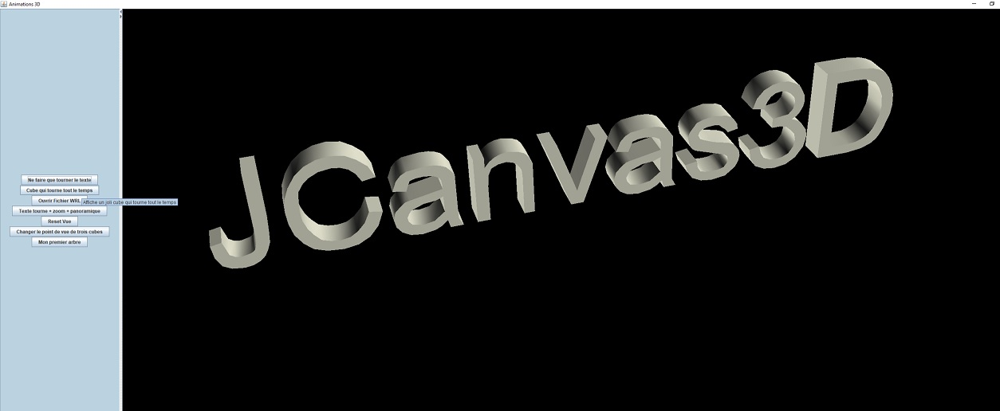
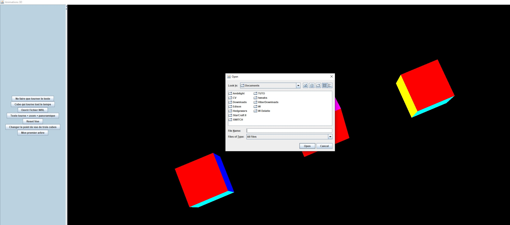

 

# Internship work

It was my first steps with Java 3D where I realized a SWING interface

<b>Make JAVA window where we will find :</b> 
Menu bar with a menu buttons to choose a file 
Window divided into 2 fields  <ul>
 <li>Left field: buttons to bring up 3D shapes and create a path tree</li>
 <li>right field: univers3D to display and use 3D shapes</li>
 </ul>

